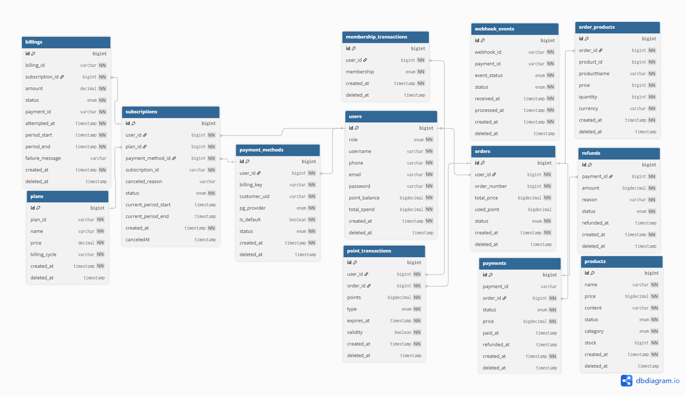

# 💳 CommerceHub - 통합 커머스 결제 플랫폼

> PortOne V2 API를 활용한 일반 결제 · 구독 결제 · 환불 · 포인트 시스템을 지원하는 Spring Boot 백엔드 프로젝트

[]()
[]()
[]()
[]()

<br/>

## 📋 목차

- [프로젝트 소개](#-프로젝트-소개)
- [주요 기능](#-주요-기능)
- [기술 스택](#-기술-스택)
- [시스템 아키텍처](#-시스템-아키텍처)
- [ERD 설계](#-erd-설계)
- [결제 플로우](#-결제-플로우)
- [CI/CD 파이프라인](#-cicd-파이프라인)
- [API 문서](#-api-문서)
- [실행 방법](#-실행-방법)
- [프로젝트 구조](#-프로젝트-구조)
- [트러블슈팅](#-트러블슈팅)
- [성능 최적화](#-성능-최적화)
- [향후 개선 계획](#-향후-개선-계획)
- [배운 점](#-배운-점)

<br/>

## 🎯 프로젝트 소개

### 프로젝트 개요

**CommerceHub**는 PortOne V2 API를 연동하여 일반 결제, 구독 결제, 환불 처리를 제공하는 통합 커머스 백엔드 플랫폼입니다.
JWT 기반 인증, 포인트 시스템, 멤버십 등급, 웹훅 서명 검증 등 실제 서비스 수준의 결제 플로우를 구현했습니다.

### 개발 기간
- **전체 기간**: [2/4 ~ 2/20]
- **기획 및 설계**: [2/4 ~ 2/5] 도메인 설계, ERD 작성, API 명세 정의
- **핵심 기능 개발**: [2/6 ~ 2/11] 결제·환불·구독 로직, PortOne 연동, 포인트·멤버십 시스템
- **CI/CD 구축**: [2/12 ~ 2/13] GitHub Actions, AWS 배포 자동화
- **테스트 및 배포**: [2/14 ~ 2/20] 단위 테스트, 통합 테스트, 운영 환경 배포

### 개발 인원

5명(곽현민, 김대훈, 김세현, 이현석, 유지현)

### 프로젝트 목표
- ✅ PortOne V2 API를 활용한 실결제 환경 구현
- ✅ JWT 기반 Stateless 인증 및 Refresh Token 로테이션
- ✅ 포인트 전액/부분 결제, 적립, 만료 시스템 구현
- ✅ 웹훅 서명 검증을 통한 안전한 결제 이벤트 처리
- ✅ 구독 정기 결제 및 멤버십 등급 자동 갱신

<br/>

## ✨ 주요 기능

### 1. 회원 인증 (Auth)

JWT Access Token + Refresh Token 이중 인증 방식을 사용합니다.
- 회원가입 / 로그인 / 로그아웃
- Refresh Token은 HttpOnly 쿠키로 관리, Access Token은 Authorization 헤더로 전달
- 토큰 재발급 (Sliding Session 방식)

### 2. 상품 및 주문 (Product / Order)

- 상품 목록 조회 및 단건 조회
- 주문 생성 시 상품 재고 자동 차감 및 품절 상태 전환
- 주문 번호 자동 생성 (`@PrePersist` 기반 타임스탬프)

### 3. 일반 결제 (Payment) ⭐

- PortOne V2 API를 연동한 결제 시작 및 확인
- 포인트 전액 결제 (PG 호출 없이 즉시 SUCCESS)
- 포인트 부분 결제 (잔여 금액만 PG 결제)
- 결제 실패 시 보상 트랜잭션(환불) 자동 수행
- 중복 결제 확인 방지 (`DuplicatePaymentConfirmException`)

### 4. **환불 처리 (Refund)** ⭐

- PortOne 환불 API 연동
- Append-Only 패턴으로 환불 이력 영구 보존
- 환불 요청 → 성공/실패 상태 분리 저장

### 5. 구독 및 정기 빌링 (Subscription / Billing)

- 구독 신청 / 조회 / 해지
- 구독 즉시 결제 (빌링키 기반)
- 청구 내역 조회

### 6. 웹훅 처리 (Webhook)

- PortOne 웹훅 수신 및 HMAC 서명 검증
- 서명 불일치 시 401 응답, 처리 실패 시 500 응답
- 웹훅 이벤트 DB 저장 (멱등성 보장)

### 7. 포인트 시스템 (Point)

- 결제 완료 시 포인트 자동 적립
- 결제 시 포인트 사용 (전액 / 부분)
- 포인트 만료 처리

### 8. 멤버십 등급 (Membership)

- 총 누적 거래액 기반 멤버십 등급 산정
- Spring `@Scheduled` 스케줄러로 매일 00:00 전체 사용자 등급 갱신
- 이벤트 기반(`ApplicationEventPublisher`) 비동기 총 거래액 업데이트

<br/>

## 🛠 기술 스택

### Backend


**상세 기술**
- **Framework**: Spring Boot 3.x, Spring MVC
- **ORM**: Spring Data JPA, Hibernate
- **Security**: Spring Security, JWT (JJWT), BCrypt
- **Validation**: Jakarta Validation (Bean Validation)
- **Template Engine**: Thymeleaf
- **HTTP Client**: Spring RestClient (PortOne API 호출)
- **Scheduler**: Spring `@Scheduled`
- **Event**: Spring `ApplicationEventPublisher`
- **Test**: JUnit 5, Mockito

### Database


- **Primary DB**: MySQL 8.0

### Infrastructure


- **Container**: Docker, Docker Compose
- **Cloud**: AWS (EC2, Parameter Store)
- **CI/CD**: GitHub Actions
- **Config**: AWS Parameter Store (환경 변수 중앙 관리)

### Tools


- **Build**: Gradle
- **PG 연동**: PortOne V2 API

<br/>

## 🏗 시스템 아키텍처

```
[Client / Browser]
        │
        ▼
[Spring Security Filter Chain]
  ├─ JWT Authentication Filter
  ├─ CORS Filter
  └─ Exception Handler

        │
        ▼
[Controller Layer]
  ├─ AuthController         ← 인증/인가
  ├─ ProductController      ← 상품 조회
  ├─ OrderController        ← 주문 생성
  ├─ PaymentController      ← 결제 시작/확인
  ├─ RefundController       ← 환불 요청
  ├─ SubscriptionController ← 구독 관리
  ├─ BillingController      ← 빌링 관리
  └─ WebhookEventController ← PortOne 웹훅 수신

        │
        ▼
[Service Layer]
  ├─ PaymentService   ── RestClient ──▶ [PortOne V2 API]
  ├─ RefundService    ── RestClient ──▶ [PortOne V2 API]
  ├─ PointService
  ├─ MembershipService
  └─ MembershipScheduler (@Scheduled, 매일 00:00)

        │
        ▼
[Repository Layer (Spring Data JPA)]
        │
        ▼
[MySQL 8.0]
```

### 주요 설계 결정사항

#### 1. Append-Only 패턴 (결제 · 환불)

결제(Payment)와 환불(Refund) 엔티티는 상태를 직접 변경하지 않고 새로운 row를 append 방식으로 저장합니다.
결제 이력의 무결성을 보장하고 감사 추적(audit trail)이 용이합니다.

#### 2. 이벤트 기반 멤버십 갱신

결제 성공 시 `TotalSpendChangedEvent`를 발행하여 멤버십 등급 업데이트를 비동기로 처리합니다.
도메인 간 결합도를 낮추고 확장성을 높였습니다.

#### 3. 웹훅 서명 검증

PortOne 웹훅 수신 시 `PortOneWebhookVerifier`로 HMAC 서명을 검증하여, 위조된 웹훅 요청을 사전에 차단합니다.

<br/>

## 📊 ERD 설계

### 전체 ERD



### 주요 테이블 설명

#### 1. **users**
```sql
CREATE TABLE users (
    id             BIGINT AUTO_INCREMENT PRIMARY KEY,
    role           VARCHAR(20)    NOT NULL,  -- USER, ADMIN
    username       VARCHAR(100)   NOT NULL,
    phone          VARCHAR(20)    NOT NULL,
    email          VARCHAR(255)   NOT NULL UNIQUE,
    password       VARCHAR(255)   NOT NULL,
    point_balance  DECIMAL(19,2)  NOT NULL DEFAULT 0,
    total_spend    DECIMAL(19,2)  NOT NULL DEFAULT 0,
    deleted_at     DATETIME,
    created_at     DATETIME       NOT NULL,
    updated_at     DATETIME       NOT NULL
);
```

#### 2. **orders**
```sql
CREATE TABLE orders (
    id           BIGINT AUTO_INCREMENT PRIMARY KEY,
    user_id      BIGINT         NOT NULL,
    order_number BIGINT         NOT NULL UNIQUE,  -- 자동 생성
    total_price  DECIMAL(19,2)  NOT NULL,
    used_point   DECIMAL(19,2),
    status       VARCHAR(30)    NOT NULL,  -- PAYMENT_PENDING, ORDER_COMPLETED, ORDER_CANCELED
    deleted_at   DATETIME,
    created_at   DATETIME       NOT NULL,
    updated_at   DATETIME       NOT NULL,
    FOREIGN KEY (user_id) REFERENCES users(id)
);
```

#### 3. **order_products**
```sql
CREATE TABLE order_products (
    id           BIGINT AUTO_INCREMENT PRIMARY KEY,
    order_id     BIGINT         NOT NULL,
    product_id   BIGINT         NOT NULL,
    product_name VARCHAR(255)   NOT NULL,
    price        DECIMAL(19,2)  NOT NULL,
    currency     VARCHAR(10)    NOT NULL,
    quantity     BIGINT         NOT NULL,
    deleted_at   DATETIME,
    created_at   DATETIME       NOT NULL,
    updated_at   DATETIME       NOT NULL,
    FOREIGN KEY (order_id) REFERENCES orders(id)
);
```

#### 4. **payments** ⭐ (핵심 테이블)
```sql
CREATE TABLE payments (
    id          BIGINT AUTO_INCREMENT PRIMARY KEY,
    order_id    BIGINT         NOT NULL,
    payment_id  VARCHAR(100),  -- PortOne 결제 ID (PAY_xxxxxxxx)
    status      VARCHAR(20)    NOT NULL,  -- PENDING, SUCCESS, FAILURE, REFUND
    price       DECIMAL(19,2)  NOT NULL,
    paid_at     DATETIME,
    refunded_at DATETIME,
    deleted_at  DATETIME,
    created_at  DATETIME       NOT NULL,
    updated_at  DATETIME       NOT NULL,
    FOREIGN KEY (order_id) REFERENCES orders(id)
);
```

#### 5. **refunds**
```sql
CREATE TABLE refunds (
    id          BIGINT AUTO_INCREMENT PRIMARY KEY,
    payment_id  BIGINT         NOT NULL,
    amount      DECIMAL(19,2)  NOT NULL,
    reason      VARCHAR(500)   NOT NULL,
    status      VARCHAR(20)    NOT NULL,  -- REQUEST, SUCCESS, FAILURE
    refunded_at DATETIME,
    deleted_at  DATETIME,
    created_at  DATETIME       NOT NULL,
    updated_at  DATETIME       NOT NULL,
    FOREIGN KEY (payment_id) REFERENCES payments(id)
);
```

### ERD 설계 포인트

#### 정규화
- 주문(orders)과 주문상품(order_products)을 분리하여 다대다 관계를 정규화
- 결제(payments)와 환불(refunds)을 별도 테이블로 관리하여 이력 추적

#### 인덱스 전략
- `users.email` - UNIQUE 인덱스 (로그인 조회)
- `orders.order_number` - UNIQUE 인덱스 (주문 번호 중복 방지)
- `payments.payment_id` - 복합 조회 최적화 (`findFirstByPaymentIdOrderByIdDesc`)

#### 제약조건
- Soft Delete 패턴 적용 (`deleted_at` 컬럼)
- Append-Only 패턴으로 결제/환불 이력 보존

<br/>

## 🔄 결제 플로우

### 전체 결제 프로세스


### 환불 프로세스


### 주요 구현 사항

#### 1. 결제 요청 API
```java
// PaymentController
@PostMapping("/payments")
public ResponseEntity<ApiResponse<StartPaymentResponse>> startPayment(
        @Valid @RequestBody StartPaymentRequest request) {
    return ResponseEntity.status(HttpStatus.CREATED).body(
            ApiResponse.success(HttpStatus.CREATED, "결제가 시작되었습니다", paymentService.start(request)));
}
```

#### 2. 포인트 결제 처리
```java
// PaymentService - 전액 포인트 결제 시 PortOne 호출 없이 즉시 SUCCESS
if (actualPaymentAmount.compareTo(BigDecimal.ZERO) == 0) {
    return handleFullPointPayment(savedPayment, user, order);
}
// 포인트 사용 후 1000원 미만 결제 방지
if (actualPaymentAmount.compareTo(BigDecimal.valueOf(1000)) < 0) {
    throw new MinimumPaymentAmountException("결제 금액은 1000원 미만일 수 없습니다.");
}
```

#### 3. 웹훅 서명 검증
```java
// PortOneWebhookVerifier
boolean verified = verifier.verify(rawBody, webhookId, webhookTimestamp, webhookSignature);
if (!verified) {
    return ResponseEntity.status(HttpStatus.UNAUTHORIZED).build();
}
```

#### 4. 보상 트랜잭션 (결제 실패 시 자동 환불)
```java
// PaymentService.confirm()
} catch (Exception e) {
    refundService.requestRefund(
            payment.getPaymentId(),
            payment.getOrder().getUser().getEmail(),
            new RefundCreateRequest());
    throw new PaymentCompensationException("결제 승인 처리 중 내부 오류로 인해 결제 취소되었습니다.");
}
```

#### 5. Append-Only 환불 처리
```java
// Refund Entity - 상태 변경 대신 새 row append
public Refund success(LocalDateTime refundedAt) {
    return new Refund(this.payment, this.amount, this.reason, RefundStatus.SUCCESS, refundedAt);
}
public Refund failure() {
    return new Refund(this.payment, this.amount, this.reason, RefundStatus.FAILURE, null);
}
```

### 결제 상태 관리

| 상태 | 설명 | 다음 가능한 상태 |
|------|------|------------------|
| `PENDING` | 결제 시작 (PG 결제창 호출 전) | `SUCCESS`, `FAILURE` |
| `SUCCESS` | 결제 성공 | `REFUND` |
| `FAILURE` | 결제 실패 | - |
| `REFUND` | 환불 완료 | - |

### 주문 상태 관리

| 상태 | 설명 | 다음 가능한 상태 |
|------|------|------------------|
| `PAYMENT_PENDING` | 결제 대기 중 | `ORDER_COMPLETED`, `ORDER_CANCELED` |
| `ORDER_COMPLETED` | 주문 완료 | `ORDER_CANCELED` |
| `ORDER_CANCELED` | 주문 취소(환불) | - |

<br/>

## 🚀 CI/CD 파이프라인

### GitHub Actions Workflow

```yaml
name: CI/CD Pipeline

on:
  push:
    branches: [ main, dev ]
  pull_request:
    branches: [ main ]

jobs:
  build:
    runs-on: ubuntu-latest
    steps:
      - uses: actions/checkout@v3
      - name: Set up JDK 17
        uses: actions/setup-java@v3
        with:
          java-version: '17'
          distribution: 'temurin'
      - name: Build with Gradle
        run: ./gradlew build
      - name: Run Tests
        run: ./gradlew test

  deploy:
    needs: build
    runs-on: ubuntu-latest
    steps:
      - name: Deploy to AWS EC2
        # AWS Parameter Store에서 환경 변수 로드 후 배포
```

### 배포 환경

#### 개발 환경 (dev branch)
- 로컬 Docker Compose 기반 개발 환경
- `application-local.yml` 프로파일 사용

#### 운영 환경 (main branch)
- AWS EC2 인스턴스 배포
- AWS Parameter Store에서 민감 정보 (DB 접속정보, JWT Secret, PortOne API Key) 자동 로드
- `application-prod.yml` 프로파일 사용

### 모니터링

#### Application Metrics
- Spring Boot Actuator (`/actuator/**`) 헬스체크 엔드포인트 제공

#### Logging
- SLF4J + Logback 기반 구조화 로깅
- 웹훅 처리 이벤트 전 구간 로그 기록 (수신 → 서명검증 → 처리 → 완료)

<br/>

## 📡 API 문서

### Base URL
```
Production: https://jihyeon1346.xyz
Development: http://localhost:8080
```

### 인증
```http
Authorization: Bearer {JWT_ACCESS_TOKEN}
```

### 주요 엔드포인트

#### 1. 회원가입
```http
POST /api/auth/register
Content-Type: application/json

{
  "email": "user@example.com",
  "password": "password123",
  "username": "홍길동",
  "phone": "010-1234-5678"
}

Response 200 OK
{
  "status": 201,
  "message": "회원가입에 성공했습니다.",
  "data": { "id": 1, "email": "user@example.com" }
}
```

#### 2. 로그인
```http
POST /api/auth/login
Content-Type: application/json

{
  "email": "user@example.com",
  "password": "password123"
}

Response 200 OK
Header: Authorization: Bearer {accessToken}
Set-Cookie: refreshToken={refreshToken}; HttpOnly; Path=/
```

#### 3. 주문 생성
```http
POST /orders
Authorization: Bearer {accessToken}
Content-Type: application/json

{
  "items": [
    { "productId": 1, "quantity": 2 }
  ]
}

Response 200 OK
{
  "status": 201,
  "message": "주문 생성에 성공했습니다.",
  "data": { "orderId": "...", "totalPrice": 20000 }
}
```

#### 4. 결제 시작
```http
POST /payments
Content-Type: application/json

{
  "orderId": "...",
  "totalAmount": 20000,
  "pointsToUse": 1000
}

Response 201 Created
{
  "status": 201,
  "message": "결제가 시작되었습니다",
  "data": {
    "paymentId": "PAY_17xxxxxxxx",
    "status": "PENDING",
    "createdAt": "2025-01-01T00:00:00"
  }
}
```

#### 5. 결제 확인
```http
GET /payments/{paymentId}

Response 200 OK
{
  "status": 200,
  "message": "성공적으로 결제되었습니다",
  "data": {
    "orderNumber": 1202501010000000,
    "status": "SUCCESS"
  }
}
```

#### 6. 환불 요청
```http
POST /refunds/{paymentId}
Authorization: Bearer {accessToken}
Content-Type: application/json

{
  "reason": "단순 변심"
}

Response 200 OK
{
  "status": 200,
  "message": "요청 접수",
  "data": { "refundId": 1, "status": "REQUEST" }
}
```

#### 7. 구독 신청
```http
POST /subscriptions
Authorization: Bearer {accessToken}
Content-Type: application/json

{
  "planId": "...",
  "paymentMethodId": "..."
}
```

### 에러 응답 형식
```json
{
  "timestamp": "2025-01-01T00:00:00",
  "status": "400",
  "error": "BAD_REQUEST",
  "message": "사용 포인트가 주문 금액을 초과할 수 없습니다.",
  "path": "/payments"
}
```

<br/>

## 🏃 실행 방법

### 사전 요구사항
- Java 17 이상
- Docker & Docker Compose
- Gradle 8.x
- MySQL 8.0 (Docker로 실행 가능)

### 로컬 개발 환경 실행

#### 1. 저장소 클론
```bash
git clone https://github.com/Sungkyunkwan-2/payment-system-project.git
cd payment-system-project
```

#### 2. 환경 변수 설정
```bash
cp .env.example .env
# .env 파일을 열어 필요한 값 설정
```

`.env` 파일 예시:
```properties
# Database
SPRING_DATASOURCE_URL=jdbc:mysql://localhost:3306/paymentSystem?serverTimezone=Asia/Seoul&characterEncoding=UTF-8
SPRING_DATASOURCE_USERNAME=root
SPRING_DATASOURCE_PASSWORD=password

# PortOne (PG 결제 게이트웨이)
PORTONE_API_SECRET=your_portone_api_secret
STORE_SECRET=store-xxxxxxxx-xxxx-xxxx-xxxx-xxxxxxxxxxxx
WEBHOOK_SECRET=whsec_xxxxxxxxxxxxxxxxxxxxxxxxxxxx

# JWT
JWT_SECRET=your-very-long-jwt-secret-key-here
```

#### 3. Docker Compose 실행 (MySQL)
```bash
docker-compose up -d mysql
```

#### 4. 애플리케이션 실행
```bash
./gradlew bootRun --args='--spring.profiles.active=local'
```

#### 5. 접속 확인
- API: http://localhost:8080
- Actuator: http://localhost:8080/actuator/health

### 프로덕션 배포

```bash
./gradlew build -x test
java -jar build/libs/payment-team-project-*.jar --spring.profiles.active=prod
```

<br/>

## 📁 프로젝트 구조

```
src
└── main
   ├── java
   │   └── com
   │       └── paymentteamproject
   │           ├── PaymentTeamProjectApplication.java
   │           ├── common
   │           │   ├── controller          ← HomeController, PageController, ConfigController
   │           │   ├── dto                 ← ApiResponse, PublicConfigResponse
   │           │   └── entity              ← BaseEntity (createdAt, updatedAt)
   │           ├── config
   │           │   ├── SecurityConfig.java
   │           │   ├── RestClientConfig.java
   │           │   ├── PortOneProperties.java
   │           │   ├── AppProperties.java
   │           │   ├── ClientApiProperties.java
   │           │   └── GlobalExceptionHandler.java
   │           ├── security
   │           │   ├── JwtTokenProvider.java
   │           │   ├── JwtAuthenticationFilter.java
   │           │   ├── JwtAuthenticationEntryPoint.java
   │           │   ├── CustomUserDetails.java
   │           │   └── CustomUserDetailsService.java
   │           └── domain
   │               ├── auth                ← 인증 (JWT, Refresh Token) 
   │               ├── user                ← 사용자 (포인트, 총 거래액)
   │               ├── product             ← 상품 (재고 관리)
   │               ├── order               ← 주문 (주문번호 자동생성)
   │               ├── orderProduct        ← 주문-상품 매핑
   │               ├── payment             ← 결제 (Append-Only, 이벤트 발행)
   │               ├── refund              ← 환불 (Append-Only)
   │               ├── subscription        ← 구독 신청/조회/해지
   │               ├── billing             ← 빌링키 결제/청구 내역
   │               ├── plan                ← 구독 플랜
   │               ├── paymentMethod       ← 결제 수단
   │               ├── pointTransaction    ← 포인트 적립/사용/만료
   │               ├── membershipTransaction ← 멤버십 등급 이력 + 스케줄러
   │               └── webhook             ← PortOne 웹훅 수신 및 검증
   │
   └── resources
       ├── application.yml
       ├── application-local.yml
       ├── application-prod.yml
       ├── client-api-config.yml
       └── templates                       ← Thymeleaf 템플릿

```

### 패키지 구조 설명

- **domain**: 각 비즈니스 도메인별로 controller / service / repository / entity / dto / consts / exception 구조 적용

- **config**: Security, PortOne, JWT, RestClient, 전역 예외 처리 등 횡단 관심사 설정

- **security**: JWT 기반 인증 필터 및 UserDetails 커스터마이징

<br/>

## 🔧 트러블슈팅

### 1. 웹훅 서명 검증 실패

**문제 상황**
```
PortOne 웹훅 요청이 Security Filter Chain을 통과하면서 request body가 소비되어
서명 검증 시 빈 body가 전달되는 문제 발생
```

**원인 분석**

Spring의 `HttpServletRequest`는 body를 한 번만 읽을 수 있어, Filter에서 body를 먼저 읽으면
Controller에서 body를 읽을 수 없게 됩니다.
또한 JWT 필터가 웹훅 엔드포인트에도 적용되어 불필요한 인증 시도가 발생했습니다.

**해결 방법**
```java
// SecurityConfig - 웹훅 엔드포인트 JWT 필터 제외
@Bean
public WebSecurityCustomizer webSecurityCustomizer() {
    return (web) -> web.ignoring().requestMatchers("/portone-webhook");
}

// WebhookEventController - raw body를 byte[]로 직접 수신
@PostMapping("/portone-webhook")
public ResponseEntity<Void> handleWebhookEvent(
        @RequestBody byte[] rawBody,
        @RequestHeader("webhook-id") String webhookId,
        @RequestHeader("webhook-timestamp") String webhookTimestamp,
        @RequestHeader("webhook-signature") String webhookSignature) {
    ...
}
```

**결과**

웹훅 서명 검증 성공률 100% 달성, 불필요한 JWT 인증 오버헤드 제거

---

### 2. 포인트 결제 시 중복 결제 문제

**문제 상황**
```
전액 포인트 결제 시 결제 시작(start) 단계에서 SUCCESS 상태로 저장되었으나,
이후 클라이언트가 결제 확인(confirm)을 재호출하는 경우 중복 처리 발생
```

**원인 분석**

결제 확인 API에서 이미 SUCCESS 상태인 결제를 재처리하려는 시도를 방어하지 않았습니다.

**해결 방법**
```java
// PaymentService.confirm()
if (payment.getStatus().equals(PaymentStatus.SUCCESS)) {
    throw new DuplicatePaymentConfirmException("이미 처리 중이거나 완료된 결제입니다.");
}
```

**결과**

멱등성 보장으로 중복 포인트 차감 및 중복 결제 방지

---

### 3. DDL Auto 운영 환경 설정 이슈

**문제 상황**
```
운영 환경 배포 시 ddl-auto: create-drop 설정으로 인해
기존 데이터가 애플리케이션 재시작 시 삭제되는 문제
```

**해결 방법**
```yaml
# application-prod.yml
spring:
  jpa:
    hibernate:
      ddl-auto: validate  # 운영 환경에서는 validate 사용
```

**결과**

운영 데이터 보호, 스키마 변경은 별도 마이그레이션 스크립트로 관리

<br/>

## ⚡ 성능 최적화

### 1. 지연 로딩 최적화

#### FetchType.LAZY 적용
```java
// Payment Entity
@ManyToOne(fetch = FetchType.LAZY, optional = false)
@JoinColumn(name = "order_id", nullable = false)
private Orders order;
```

**적용 대상**
- Payment → Orders 연관관계
- Orders → User 연관관계
- Refund → Payment 연관관계

**효과**

불필요한 조인 쿼리 제거로 조회 성능 개선

---

### 2. 데이터베이스 최적화

#### 인덱스 최적화
```sql
-- 결제 ID 조회 최적화 (Append-Only 패턴으로 최신 레코드 조회)
-- PaymentRepository
Payment findFirstByPaymentIdOrderByIdDesc(String paymentId);
```

**결과**

결제 확인 API 응답 속도 개선

#### 커넥션 풀 최적화
```yaml
spring:
  datasource:
    hikari:
      maximum-pool-size: 10
      minimum-idle: 5
      connection-timeout: 30000
```

---

<br/>

## 📈 향후 개선 계획

### Service 책임 분산을 위한 이벤트 기반 구조 도입
### Refresh Token 해시 저장
### 외부API 호출 트랜잭션 분리
### 웹훅 & 외부 API 처리 멱등성 보장 강화
### 동시성 체크 강화

<br/>

## 💡 배운 점

### 기술적 성장

#### 1. PortOne V2 API 연동 경험

결제 시작 → PG 결제창 호출 → 결제 확인 → 웹훅 수신까지 전체 결제 플로우를 직접 구현하면서,
실제 서비스에서 PG 연동이 얼마나 복잡한지 이해했습니다.
특히 웹훅 서명 검증과 멱등성 처리의 중요성을 실감했습니다.

#### 2. Append-Only 패턴의 중요성

결제와 환불 이력을 UPDATE가 아닌 새 row INSERT로 관리함으로써
데이터 무결성을 보장하고 감사 추적이 용이해졌습니다.
이 패턴이 금융 도메인에서 왜 필수적인지 이해했습니다.

#### 3. 이벤트 기반 아키텍처

`ApplicationEventPublisher`를 활용하여 결제 완료 이벤트와 멤버십 갱신을 분리함으로써
도메인 간 결합도를 낮추고 코드의 단일 책임 원칙을 지킬 수 있었습니다.

#### 4. JWT 인증 심화 이해

Access Token + Refresh Token 이중 구조, HttpOnly 쿠키를 통한 Refresh Token 관리,
CORS 환경에서의 Authorization 헤더 노출 설정 등 실무 수준의 인증 구현을 경험했습니다.

### 개발 프로세스

#### 1. 도메인 주도 설계 (DDD) 시도

각 도메인(payment, order, refund 등)을 독립적인 패키지로 분리하고,
도메인 로직을 서비스가 아닌 엔티티에 최대한 응집시키는 설계를 연습했습니다.

#### 2. 예외 처리 전략

`GlobalExceptionHandler`와 커스텀 예외 클래스를 통해 일관된 에러 응답 형식을 유지했습니다.
비즈니스 예외(`BusinessException`)와 시스템 예외를 명확히 구분하는 방법을 배웠습니다.

#### 3. 환경 분리의 중요성

`application-local.yml`, `application-prod.yml`로 환경을 분리하고,
AWS Parameter Store를 통한 민감 정보 관리로 보안을 강화했습니다.

### 아쉬운 점 및 개선 방향

#### 1. 테스트 커버리지 부족

핵심 비즈니스 로직(PaymentService, RefundService)에 대한 단위 테스트를 충분히 작성하지 못했습니다.
향후 TDD 방식으로 결제 플로우 전체 테스트를 작성할 예정입니다.

#### 2. Redis 미도입

현재 Refresh Token을 RDB에 저장하고 있어 성능 병목이 우려됩니다.
Redis를 도입하여 Refresh Token 관리 및 상품 목록 캐싱에 활용할 계획입니다.

#### 3. API 문서 자동화 미비

현재 Swagger UI 설정은 있으나 어노테이션 기반 문서화가 부족합니다.
SpringDoc OpenAPI 3.0으로 전환하여 API 문서를 자동화할 예정입니다.

<br/>

## 👨‍💻 개발자

**팀명**: 성균관 <br>
**소속**: 내일배움캠프 실시간 커머스 플랫폼 개발자 양성 과정 2기 <br>
**GitHub**: [https://github.com/Sungkyunkwan-2/payment-system-project](https://github.com/Sungkyunkwan-2/payment-system-project)

**이름**: 곽현민 <br>
**직책**: 팀장 <br>
**담당 파트**: 결제, 구독 <br>
**Github**: https://github.com/prAha1030 <br>
**Email**: hunmin111@gmail.com <br>

**이름**: 김세현 <br>
**직책**: 팀원 <br>
**담당 파트**: jwt 기반 stateless 인증, refresh token, erd 작성, 이벤트리스너 구현<br>
**Github**: https://github.com/ginsengcandy <br>
**Email**: kimsparadise0202@gmail.com <br>

**이름**: 김대훈 <br>
**직책**: 팀원 <br>
**담당 파트**: 주문 생성, 주문 목록 조회, 포인트 관련 로직과 연계된 메서드 작성, 발표<br>
**Github**: https://github.com/BigMacHun-del<br>
**Email**: eogns12312@naver.com<br>

**이름**: 이현석 <br>
**직책**: 팀원 <br>
**담당 파트**: 환불, 멤버십, 발표 자료 준비<br>
**Github**: https://github.com/royhslee0120<br>
**Email**: royhslee0120@gmail.com<br>

**이름**: 유지현 <br>
**직책**: 팀원 <br>
**담당 파트**: webhook, subscription <br> 
**Github**: https://github.com/jihyeon1346 <br> 
**Email**: yio1346@gmail.com <br> 


<br/>

## 📄 라이선스

This project is licensed under the MIT License - see the [LICENSE](LICENSE) file for details.

<br/>

## 🙏 감사의 말

PortOne V2 API 문서 및 공식 예제 코드를 참고하였습니다.

---

⭐ 이 프로젝트가 도움이 되셨다면 Star를 눌러주세요!
